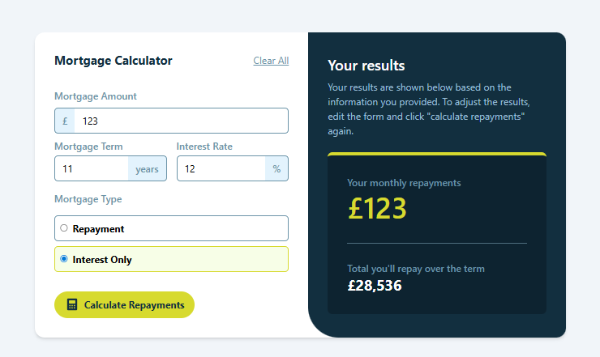
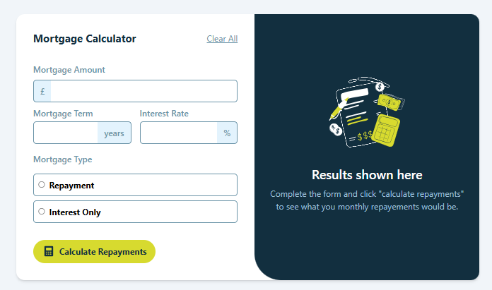
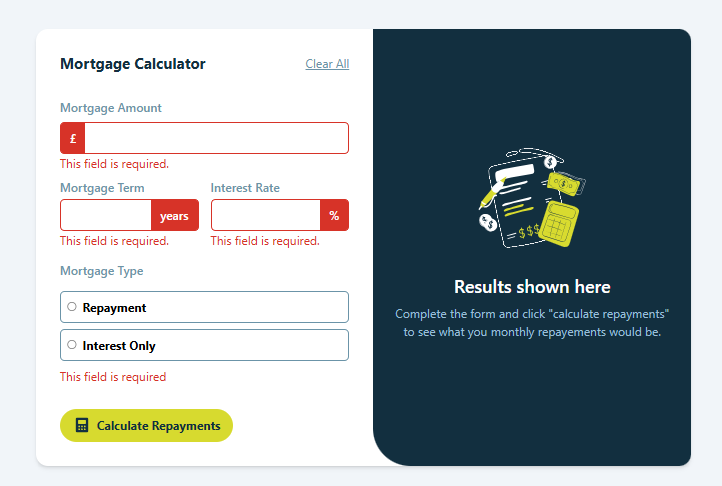

# Frontend Mentor - Mortgage repayment calculator solution

This is a solution to the [Mortgage repayment calculator challenge on Frontend Mentor](https://www.frontendmentor.io/challenges/mortgage-repayment-calculator-Galx1LXK73). Frontend Mentor challenges help you improve your coding skills by building realistic projects.

## Table of contents

- [Overview](#overview)
  - [The challenge](#the-challenge)
  - [Screenshot](#screenshot)
  - [Links](#links)
- [My process](#my-process)
  - [Built with](#built-with)
  - [What I learned](#what-i-learned)
  - [Continued development](#continued-development)
  - [Useful resources](#useful-resources)
- [Author](#author)

## Overview

### The challenge

Users should be able to:

- Input mortgage information and see monthly repayment and total repayment amounts after submitting the form
- See form validation messages if any field is incomplete
- Complete the form only using their keyboard
- View the optimal layout for the interface depending on their device's screen size
- See hover and focus states for all interactive elements on the page

### Screenshot

### Links

- Solution URL: [Solution](https://github.com/deoruchi/repaymortgage)
- Live Site URL: [Live Site](https://your-live-site-url.com)

## My process

### Built with

- [React](https://reactjs.org/) - JS library
- [TailwindCss](https://tailwindcss.com/) - Css Library

### What I learned

I learned how to add the font file of fromat .ttf. I used tailwindcss v4 which is far more easier now and I had a good experience using it as a developer.

### Continued development

- Dark-mode toggle with Tailwind dark: variants
- Unit tests with React Testing Library

## Author

- Frontend Mentor - [@deoruchi](https://www.frontendmentor.io/profile/deoruchi)
- Twitter - [@simple_smile9](https://www.x.com/simple_smile9)
